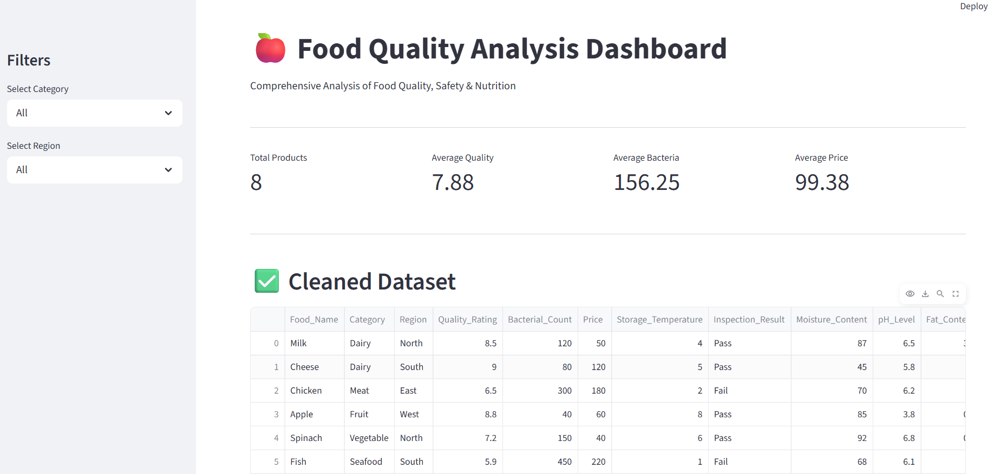
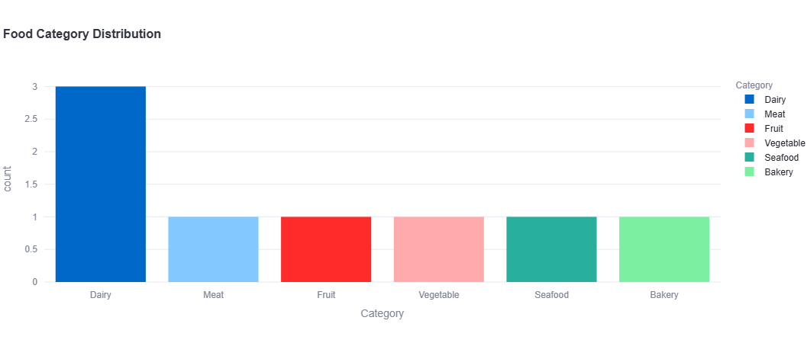
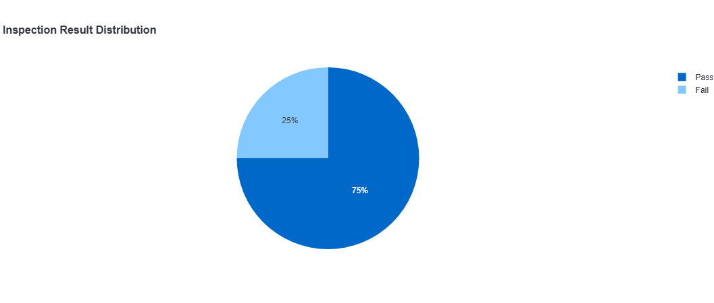
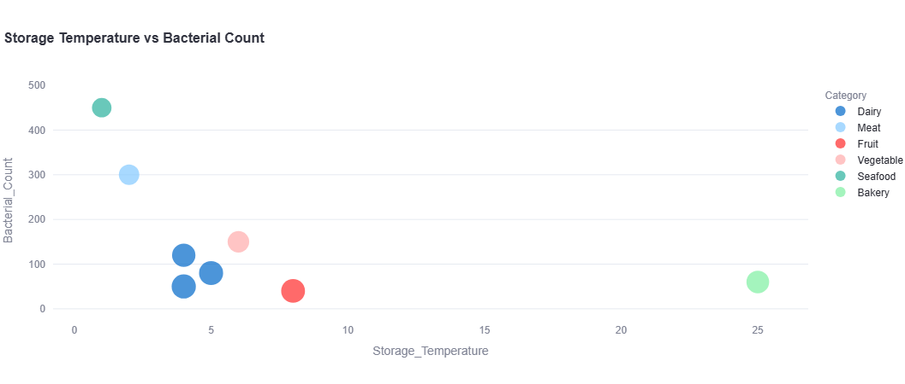

# 🍽️ Food Quality Analysis Dashboard

An interactive **Food Quality Analysis Dashboard** built using **Python**, **Streamlit**, **Pandas**, **Plotly**, and **Scikit-learn**. This project analyzes food quality datasets, provides interactive visualizations, statistical summaries, and machine learning-based predictions.

---

## 📌 Features

- 📂 Upload food quality datasets
- 📊 Interactive charts and graphs
- 📈 Exploratory Data Analysis (EDA)
- 📉 Statistical summary
- 🤖 Food quality prediction using Machine Learning
- 🎯 User-friendly dashboard with filters

---

## 📷 Dashboard Preview

### 🏠 Home Dashboard


### 📊 Food Category Distribution


### ⭐ Food Quality Ratings


### ✅ Inspection Result Distribution


### 🌡️ Storage Temperature vs Bacterial Count


---

## 🛠️ Technologies Used

- Python
- Streamlit
- Pandas
- Plotly
- Scikit-learn
- NumPy

---

## 📂 Project Structure

```
Food-Quality-Analysis-Dashboard/
│
├── app.py
├── requirements.txt
├── food_quality_dataset.csv
├── README.md
│
├── dashboard-overview.png
├── food-category-distribution.png
├── food-quality-ratings.png
├── inspection-result-distribution.png
└── storage-temperature-vs-bacterial-count.png
```

---

## 📁 Dataset

- Food Quality Dataset (CSV)

---

## 🚀 Installation

Clone the repository:

```bash
git clone https://github.com/lakshmidevilakshmidevi689-max/Food-Quality-Analysis-Dashboard
```

Install dependencies:

```bash
pip install -r requirements.txt
```

Run the application:

```bash
streamlit run app.py
```

---

## 🎯 Future Enhancements

- User Authentication
- PDF Report Generation
- Cloud Deployment
- Real-time Data Analysis
- More Machine Learning Models

---

## 👩‍💻 Author

**Lakshmidevi P M**

Computer Science and Engineering 

---

## ⭐ If you like this project

Please consider giving this repository a ⭐ on GitHub.
